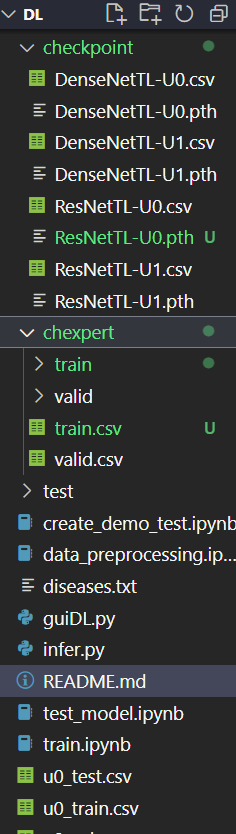

# CHEST X-RAY DISEASES CLASSIFICATION
[Dataset link](https://www.kaggle.com/datasets/ashery/chexpert). Please rename the archive folder to chexpert.

[Model checkpoint link](https://drive.google.com/drive/folders/1jxqVEDs67HrPaRtKtaOJvb3OpqdeHwG4?usp=sharing). Please put the checkpoint folder inside the root directory.

[Report](https://github.com/buinguyenkhai/deep-learning-20241-chexpert-classification/blob/main/dl_project_report.pdf)

Example:




Test folder is a small sample from the test set for inference and GUI showcase. Read `create_demo_test.ipynb` for more details.

The csv files here are re-splited from the original dataset to train/validation/test (80/10/10).


Files in order:
1. `data_preprocessing.ipynb`
2. `train.ipynb`
3. `test_model.ipynb`
4. `create_demo_test.ipynb`
5. `guiDL.py`
6. `infer.py`

Inference guide:
```
git clone https://github.com/buinguyenkhai/deep-learning-20241-chexpert-classification.git
```
```
cd deep-learning-20241-chexpert-classification
```
```
pip install -r requirements.txt
```
```
python3 infer.py --model_name model_name --image_path relative_test_image_path
```
```
python3 infer.py --model_name ResNetTL-U1 --image_path test\u1\chexpert\train\patient00005\study1\view1_frontal.jpg
```
